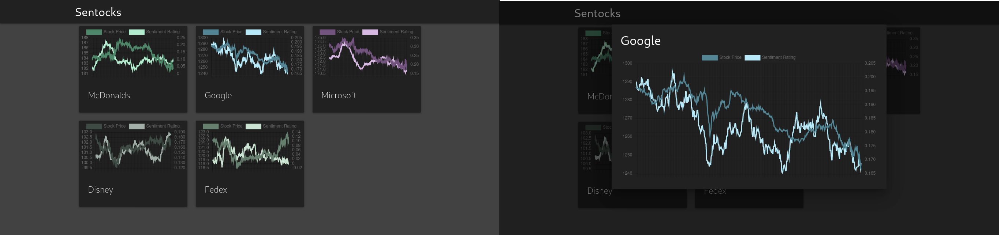

**Sentocks** is a sentiments rating analysis tool! We know if 
traders are confident in a stock, then the said stock value 
goes up. What if we try to analyze people's feelings and 
emotions about something and see where we can go from there?

**Sentocks** or **Sentimental Stocks** grabs twitter feed by
searching on pre-determined keywords and applies some quick 
sentiment analysis to get a rough estimate on one's sentiment
about a topic. 

Below is an example of how it looks for some companies on
`2020-04-25` from `15:30 -> 00:30 UTC` 


The question is, **is there a correlation between sentiments 
and the stock market?**

## Initial results

Picture below is an example of comparing sentiment ratings and stock
market values on `2020-04-28` (**Click to zoom in**)



## Testing your or our data

We have a [collaboratory google jupyter notebook](https://colab.research.google.com/drive/1GsM5fP4Q6vdLs_Ct2WDGNDeKHH_hEq9R) where you can add any endpoints and test the data
for its correctness, etc. Python code there does all the plotting and figuring out
the incoming format.

## Microservice architecture

This is the layout of basic services we have running


- `server`: handles all interactions with the database, non-GET have to be authorized
- `twippy`: actual twitter feed listener and raw sentiment submitter. Sends raw data to `server`
- `josh`: takes raw data from `server` and performs a window averaging algorithm to get processed sentiment data
- `bobby`: A small goroutine in server.go that deletes raw sentiment database entries that are more than 24 hours old
- `trump`: same as `twippy` but only listens for **POTUS** related keywords
- `caddy`: the webserver that proxies incoming requests to `server` and `vuejs`
- `postgres`: the database stores the companies, raw sentiments and processed average sentiment values.
- `vuejs`: the frontend that connects to alphavantage api and `server`'s processed sentiments

## How to start

Everything is handled with a dockerfile and environmental variables. Run

```sh
cp .env.example .env
```

and fill out `.env` to your liking, with your twitter keys and some unique `WEB_KEY`

If you're running a local caddy, leave `CADDY_WEB_ADDRESS` as `localhost` where you can later
access the website through `localhost:2015` and api (`server`) through `localhost:2015/api/`

## Scripts

You can test your twitter token by running `./scripts/tokentest.sh`

You can test the python code by running `./scripts/pytest.sh`

You can get Go dependencies for go testing by running `./scripts/deps.sh`

You can test Go code by running `./scripts/test.sh`

You can deploy a full environment by running `./scripts/prod.sh`

## Authors

- [Sandy Urazayev](https://github.com/thecsw) - DB handling, Go/Python
- [Drake Clark](https://github.com/drmk3) - Smoothing algorithm, Go/Python 
- [Ross Copeland](https://github.com/ross-hugo) - Infrastructure, Docker and documents
- [Dylan Prebyl](https://github.com/red2fred2) - Sentocks webpage, VueJS
- [Jonathan Downs](https://github.com/JMDowns) - Twippy, documentation, testing, Python

## License

For all your licensing questions, please refer to [our license](./LICENSE)
