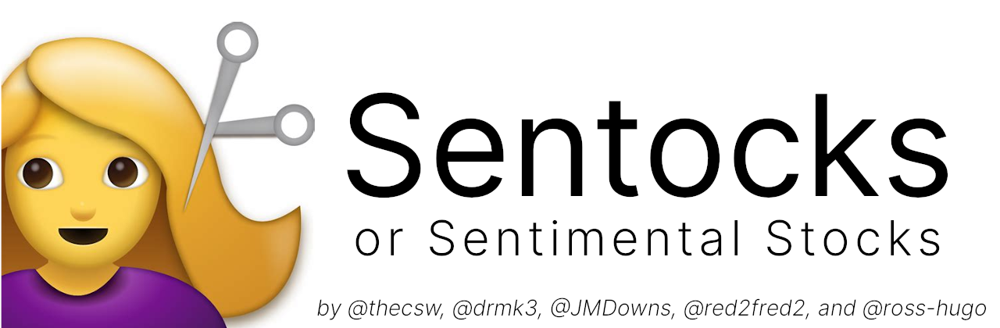
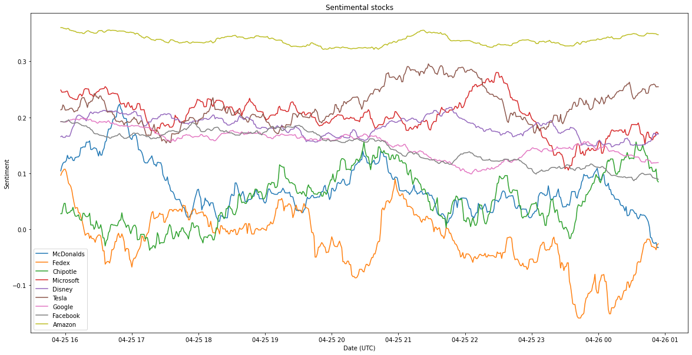
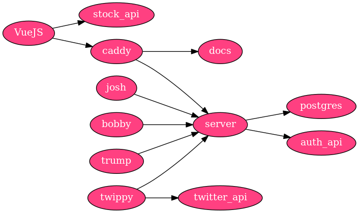

**Sentocks** is a sentiments rating analysis tool! We know if 
traders are confident in a stock, then the said stock value 
goes up. What if we try to analyze people's feelings and 
emotions about something and see where we can go from there?

**Sentocks** or **Sentimental Stocks** grabs twitter feed by
searching on pre-determined keywords and applies some quick 
sentiment analysis to get a rough estimate on one's sentiment
about a topic. 

Below is an example of how it looks for some companies:

The question is, **is there a correlation between sentiments 
and the stock market?**

## Microservice architecture

This is the layout of basic services we have running

